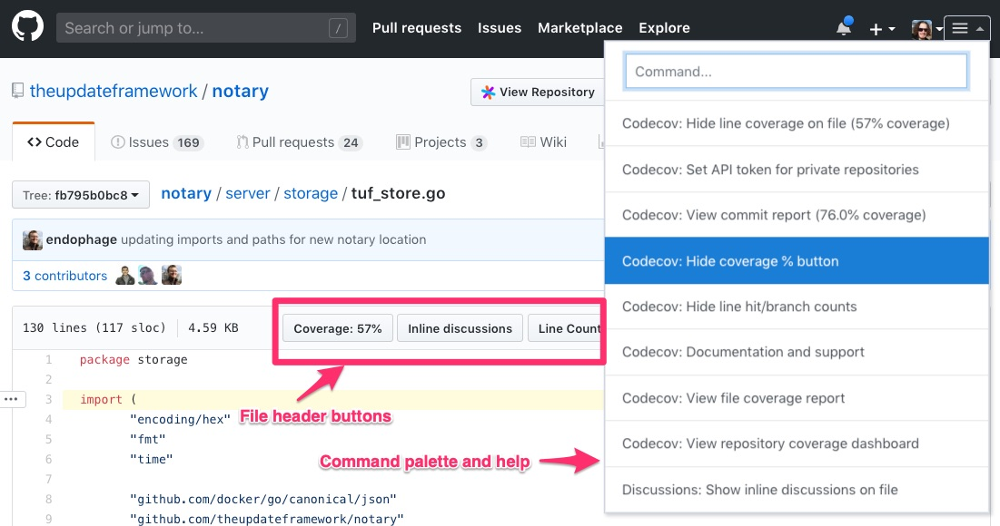
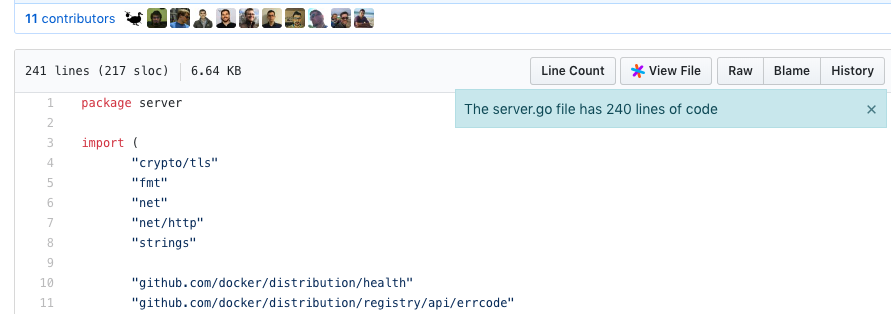

# Sourcegraph extension contributions tutorial

Difficulty | Time
---- |:--------:|
Intermediate | 30 minutes

**Contributions** are the combination of UI elements configured by your Sourcegraph extension that invoke built-in and custom functionality. When present, UI elements can only be added to pre-defined locations such as:

- The file header
- Command palette
- Help menu



<!-- **Note**: Here is the complete list of [contribution points](https://sourcegraph.com/github.com/sourcegraph/sourcegraph/-/blob/shared/src/api/protocol/contribution.ts#L192:13).  -->

<!-- TODO: Ryan What `ContributableMenu` points are supported in Sourcegraph and code hosts. Are they meant to be different? -->

<!-- Sourcegraph extensions can create buttons and menu items on Sourcegraph.com, GitHub and other supported code hosts. -->
<!-- 
UI contributions are pre-defined in `package.json` at `.contributions`, and through template expressions, can react to changes in the context, e.g. only showing a button if the language of a file is Go. -->

## What you will be building

This tutorial will teach you how to add a button to the file header that when clicked displays a notification containing the file name and number of lines of code.



If you get stuck at any point or just want to look at the code, you can get it from the [Sourcegraph extensions sample repository](https://github.com/sourcegraph/sourcegraph-extension-samples/tree/master/line-counter).

## Prerequisites

This tutorial presumes you have created and published an extension. If not, complete the [Hello world tutorial](hello-world.md) first.

Create the extension, adding a prefix to the name to ensure it is unique.

```
mkdir line-counter
cd line-counter
npm init sourcegraph-extension
```


Publish your extension:

```src ext publish```

Then confirm your extension is enabled and working by:

- Opening the extension detail page.
- Viewing a file on Sourcegraph.com and seeing your extensions hover message appearing.

## Sourcegraph extension Actions and Menu Items

An **Action** is `JSON` with a unique identifier (string) that defines the properties of the UI element, e.g. `label`, as well as the `command`, which is the name of a registered callback to invoke.

A **Menu Item** is `JSON` that specifies which UI element to add the **Action** to.


## Adding an Action

Add the following code to `package.json` in the `.contributions.actions` array:

```json
{
  "id": "linecounter.get",
  "command": "updateConfiguration",
  "actionItem": {
    "label": "Line Count",
    "description": "Get line count for this file"
  }
}
```

This `JSON` is processed by the extension runtime to create an [`ActionContribution`]((https://sourcegraph.com/github.com/sourcegraph/sourcegraph/-/blob/shared/src/api/protocol/contribution.ts#L22:18)) object:

To explain this `JSON`:

- `id`: Unique identifier for this action (must be unique for all actions).
- `command`: The command will be invoked in its active state (this will change to a custom method later).
- `actionItem.label`: The item text.
- `actionItem.description`: The text in the button tooltip on focus or hover.

**Note**: The [`actionItem`](https://sourcegraph.com/github.com/sourcegraph/sourcegraph/-/blob/shared/src/api/protocol/contribution.ts#L161:18) field is only required for actions in `editor/title`.

## Adding the Action to the file header

Now that an **Action** exists, we must choose which part of the UI it will be inserted into. We have chosen the **file header** because it's the most easily accessible and close to the code.

Add the following code to `package.json` in the `.contributions.menus.editor/title` array:

```json
{
  "action": "linecounter.get",
  "when": "resource"
}
```

This `JSON` is processed by the extension runtime to create a [`MenuItemContribution`](https://sourcegraph.com/github.com/sourcegraph/sourcegraph/-/blob/shared/src/api/protocol/contribution.ts#L217:18) object.

To explain this `JSON`:

- `action`: The **Action** to invoke when the **Menu Item** is in its active state. Matches the `id` value of an **Action**.
- `when`: An (optional) expression that must evaluate to true (or a truthy value). If the result of the expression is false or falsey, the **Menu Item** will not be displayed.

Setting `"when"` to the value `"resource"` means the **Menu Item** will display only when a `resource` (document) is available.

<!--TDO Ryan Check out the [extension activation tutorial](activation.md) for a more complex usage of the `when` field.-->

You now have the code required to display a button so let's test it.

## Check that the button displays

Test it by:

- Publishing the extension.
- Viewing a file on Sourcegraph.com or GitHub.
- You should see a **Line Count** button in the header above the file.
- View the [Sourcegraph repository page](https://sourcegraph.com/github.com/sourcegraph/sourcegraph) and the **Line Count** button should not be displayed.

## Extension application code

Now that we have the button, the next step is to display the notification. We'll code this in 3 steps. 

## Extension code part 1. Registering a custom method

Open the TypeScript file in `src` and delete all the code. Then replace it with:

```typescript
import * as sourcegraph from 'sourcegraph'

export function activate(): void {
  const commandKey = 'linecounter.displayLineCount'

  sourcegraph.commands.registerCommand(commandKey, (uri:string, text: string) => {
    // Call to display notification here
  })
}
```

When the extension is activated, it will use the [`sourcegraph.commands.registerCommand(command: string, callback: function)`](https://unpkg.com/sourcegraph/dist/docs/modules/_sourcegraph_.commands.html#registercommand), function to register a callback that can be invoked by our **Action** by using the value of the `command` argument.

## Extension code part 2. Configure the action to call the custom method

To configure the action, open the `package.json` replace the contents of the item in `.contributes.actions` with:

```json
{
  "id": "linecounter.get",
  "command": "linecounter.displayLineCount",
  "commandArguments": [
    "${resource.uri}",
    "${resource.textContent}"
  ],
  "actionItem": {
    "label": "Get line count",
    "description": "The line count for this file"
  }
}
```

The value of the `command` field now matches the custom method identifier from step 1 and the `commandArguments` array provides the arguments required by our callback (`uri:string, text: string`).

<!--
TODO: Ryan Link to template lang docs
The syntax to get the argument values is a *template expression** which is a simple and very limited template language.
-->

We can rely on the `resource` object being defined here because our button will display only if there is a `resource`. The `resource` object is a generic object and you can get the list of object keys [from this switch statement](https://sourcegraph.com/github.com/sourcegraph/sourcegraph/-/blob/shared/src/api/client/context/context.ts#L60:9).

## Extension code part 3. Showing the notification

The last step is to write the code that shows the file name and line count in a notification.

In your TypeScript extension file, replace `// Call to display notification here` with:

```typescript
    const activeWindow: sourcegraph.Window | undefined = sourcegraph.app.activeWindow
    if(!activeWindow) {
        return;
    }

    const lineCount = text.split(/\n/).length - 1;
    const fileName = uri.substring(uri.lastIndexOf('/') + 1);

    activeWindow.showNotification(`The ${fileName} file has ${lineCount} line${lineCount > 1 ? 's' : ''} of code `)
```

This code:

- Checks that there is an active `Window` object.
- Gets the file name and line count values.
- Displays a notification.

Now publish the extension to see the line counter extension in action!

## Summary

As a result of completing this tutorial, you've learnt:

- How to register a custom method.
- How to create an **Action** that supplies arguments to the custom method.
- How to create a **Menu Item** which adds the **Action** to the UI.
- How to display a notification.

While this tutorial focussed on adding a button to the file header, the process is the same for the other contribution types, e.g. adding a **Menu Item** to the command palette.

## Next Steps

- [Cookbook for writing Sourcegraph extensions](../cookbook.md)
- [Sourcegraph extension activation]
- [Debugging a Sourcegraph extension]
